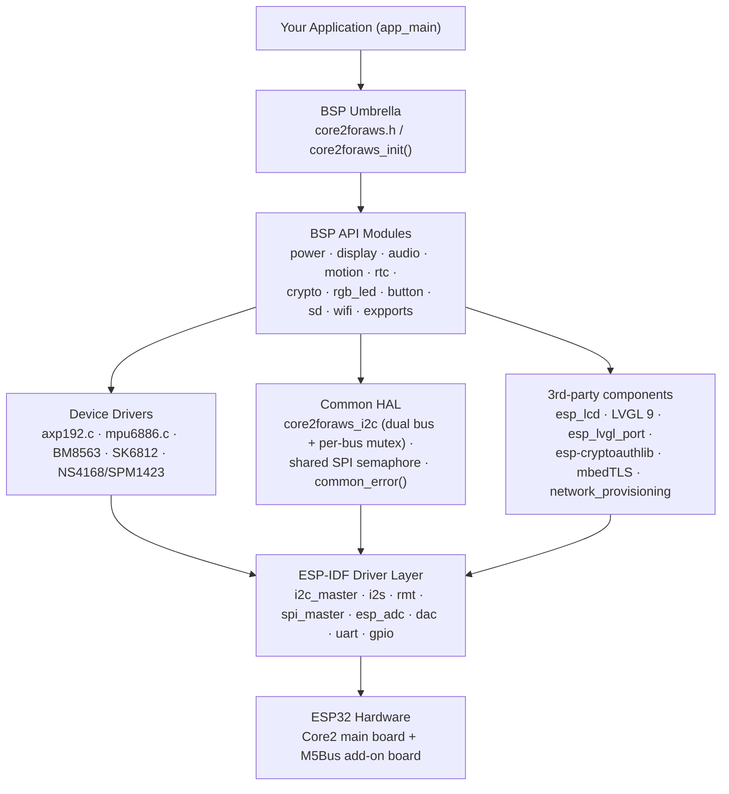
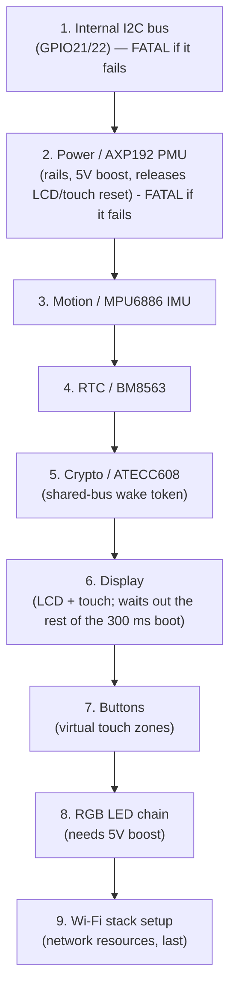
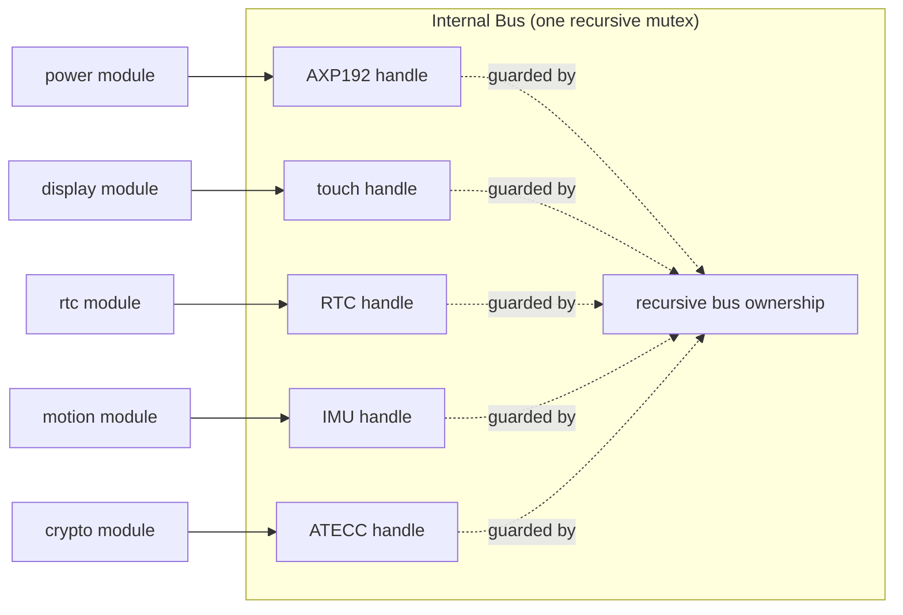

# Design Document — M5Stack Core2 for AWS IoT Kit BSP

> **Audience:** Embedded/IoT developers who are newer to ESP32, ESP-IDF, and
> board support packages (BSPs). This document explains *what* the BSP is, *how*
> it is structured, and — most importantly — *why* it is built this way. The two
> guiding goals of this project are **stability** and **ease of understanding**.
> **Living document:** this design doc is expected to evolve alongside the BSP.
> When the code changes (init flow, public APIs, modules, shared-resource
> handling, power, build config, or pin usage), this document must be updated in
> the same change. The maintenance contract is defined in
> [.claude/rules/design-doc.md](../.claude/rules/design-doc.md).

---

## 1. What this BSP is (and is not)

A **Board Support Package (BSP)** is a layer of software that sits between your
application and the physical hardware. Its job is to hide the messy,
board-specific details — exact GPIO pin numbers, power sequencing, shared-bus
arbitration — so that your application can say "turn on the speaker" instead of
"set AXP192 register 0x12 bit 2, wait, then configure the I2S controller."

This BSP targets the **M5Stack Core2 for AWS IoT Kit** specifically: the Core2
main unit plus the AWS-specific **M5GO Bottom**. That combined kit is **not** the
same as the standard M5Stack Core2 by itself:

- It adds an **M5Bus add-on board** carrying a microphone, a 10-pixel addressable
  RGB LED strip, an MPU6886 IMU, and an **ATECC608 secure element** (used for AWS
  IoT device identity).
- Because of this, several "free-looking" GPIOs are actually committed to add-on
  hardware. The BSP encodes the *correct* wiring so you never have to guess.

**What it is:** a curated set of drivers + a single `core2foraws_init()` entry
point, currently validated with ESP-IDF v6.1.0. Earlier v5.3/v6.0 validation
predates the latest dependency update. PlatformIO is
supported at the consuming-application level rather than by this component
repository directly.

**What it is not:** a general-purpose ESP32 devkit library. Do not assume
standard ESP32 devkit pin defaults — this board reuses many pins for specific
purposes.

---

## 2. Design goals and principles

| Principle | What it means in practice |
| --- | --- |
| **Stability first** | Shared hardware (buses, the audio clock) is protected by a lock. Successfully initialized modules are idempotent, and failures are returned rather than aborting the application. |
| **One obvious entry point** | The application includes [core2foraws.h](../include/core2foraws.h) and calls `core2foraws_init()` for automatic modules. Audio, SD, expansion-port sessions, and Wi-Fi start remain explicit. |
| **Hardware truth, encoded once** | Pin maps, power sequencing, and shared-bus rules live in the BSP, not in your app. See [.claude/rules/pinmap.md](../.claude/rules/pinmap.md) and [.claude/rules/board.md](../.claude/rules/board.md). |
| **Predictable error handling** | Every public function returns `esp_err_t`; values are returned through output parameters. You can always check success the same way. |
| **Readable over clever** | Device drivers are thin and explicit, with board bus and power dependencies visible at their call sites. |
| **Pay only for what you use** | The master `SOFTWARE_BSP_SUPPORT` switch gates the common and hardware layers; individual hardware modules are further gated by their `CONFIG_SOFTWARE_*` flags. |

---

## 3. The big picture (layered architecture)

The BSP is organized into clear layers. Dependencies flow toward the hardware,
with explicit module-to-module dependencies where the board requires them
(buttons use display/touch, and audio uses power control).



**How to read this:**

1. **Application layer** — your code. It includes one header and calls one init
   function.
2. **BSP API layer** — the `core2foraws_<module>_*` functions. This is the public
   surface you call. It is board-aware and hides pin numbers and sequencing.
3. **Device-driver layer** — focused chip drivers (e.g. `axp192.c`,
   `mpu6886.c`). They contain register and conversion logic while board-facing
   wrappers connect them to the common I2C transport.
4. **Common HAL layer** — the shared-resource managers. This is where the two I2C
   buses, the one shared SPI bus, and the single audio clock are coordinated.
   **This layer is the heart of the "stability" goal.**
5. **ESP-IDF + managed components** — Espressif's official drivers and third-party
   libraries.

---

## 4. The single entry point: `core2foraws_init()`

The application's first BSP call is almost always:

```c
#include "core2foraws.h"

void app_main( void )
{
    esp_err_t err = core2foraws_init();
    if( err != ESP_OK )
    {
        // One or more automatic modules failed; see logs or initialize
        // individual modules when per-module recovery is required.
    }
    // ... your code ...
}
```

Internally, `core2foraws_init()` brings subsystems up **in a deliberate order**.
Order matters because later subsystems depend on earlier ones (for power rails or
the I2C bus). Each step is compiled in only if its Kconfig flag is enabled.



**Key design decisions in this sequence:**

- **Internal I2C and the PMU are mandatory early-return steps.** Almost every
  on-board chip (PMU, touch, RTC, IMU, secure element) lives on this bus. If it
  cannot come up, `init` returns its original error. A PMU error likewise stops
  startup before any downstream peripheral can use uncertain power/reset state.
- **Power (AXP192) comes second.** The PMU owns the rails that feed the display,
  the SD card, the vibration motor, and the 5V boost for the LED strip. It also
  drives the shared LCD/touch reset line. Bringing it up early means downstream
  peripherals have stable power before they are probed.
- **Fixed I2C sensors initialize while the display boots.** The PMU releases
  the LCD/touch reset and records the time instead of blocking. The FT6336
  reference gives no start-up timing, so the BSP keeps a conservative 300 ms.
  IMU, RTC and secure-element init run in that window, and
  `core2foraws_display_init()` then waits only for whatever remains (via
  `core2foraws_power_lcd_ready_wait()`). The IMU likewise does not block for
  its gyroscope start-up (up to 100 ms); the first accelerometer or gyroscope
  read waits out any remainder.
- **Crypto (ATECC608) comes after the IMU and RTC.** Each secure-element
  command starts with an I2C general-call wake token. The common I2C wrapper
  serializes that token with every other internal-bus transaction and treats
  the secure element's expected wake-token NACK as success; init order alone is
  not relied on for runtime bus safety. Ordinary traffic to other internal
  devices also wakes the ATECC608 (any SDA-low stretch of 60 us or more), which
  silently starts its ~1.36 s watchdog; a command landing in the last ~40 ms
  then fails with status 0xEE. The HAL therefore sends Idle (which keeps
  TempKey) immediately before every wake token, so each command sequence
  starts a full watchdog period.
- **Later failures are aggregated.** After the I2C bus and PMU, each step's result is
  accumulated (`ret |= err`) and normalized to `ESP_FAIL`. A bad peripheral
  does not stop later modules from being attempted. The logs identify each
  failed module; applications that need exact recovery initialize the relevant
  module independently and inspect its original error code.
- **Wi-Fi failures are returned.** The Wi-Fi helper does not use aborting error
  checks and never erases the default NVS partition during initialization.
- **Audio, SD card, expansion-port sessions, and Wi-Fi start are intentionally
  on demand.** They claim I2S, filesystem/SPI, external bus/UART, or radio
  resources only when requested.

### 4.1 Module lifecycle and ownership

| Module | Initialization policy | Long-lived resources | Release / shutdown |
| --- | --- | --- | --- |
| common + internal I2C | Automatic foundation when BSP support is enabled; omitted entirely when disabled | Permanent I2C_NUM_0 bus, static recursive mutex, managed fixed-device handles | Board-lifetime resource; deinit is rejected |
| power | Automatic, after internal I2C | AXP192 device handle and configured rails | `core2foraws_power_off()` requests normal PMU shutdown; direct MCU-rail disable/reconfiguration is protected |
| display | Automatic when enabled | SPI LCD device, locked touch handle, LVGL task and DMA buffers | `core2foraws_display_deinit()` stops refresh, waits for active DMA, and takes internal-I2C ownership before releasing touch/display/LVGL resources; shared SPI2 remains active |
| button | Automatic when enabled | Poll task and callback mutex | No public deinit; lifetime is the application lifetime |
| motion / RTC / crypto | Automatic when enabled | Internal-I2C device handles; crypto library state | No public deinit; lifetime is the application lifetime |
| RGB LED | Automatic when enabled | RMT channel and encoder | `core2foraws_rgb_led_deinit()`; failed cleanup retains resources and blocks init/write until retry succeeds |
| Wi-Fi | Stack setup is automatic; idempotent `core2foraws_wifi_start()` is explicit | Default STA netif, event handlers/group, Wi-Fi driver, optional provisioning manager | `core2foraws_wifi_deinit()` stops provisioning/radio before releasing BSP-owned resources |
| audio | Explicit speaker or microphone enable | I2S_NUM_0 channel; GPIO0 ownership; one lifecycle/data mutex | Disable retains resources on failure; retry false before data I/O or enabling either mode; speaker shutdown hold remains >100 us |
| SD | Explicit `core2foraws_sd_mount()` | SDSPI device, FAT mount at `/sd_card`, state mutex | `core2foraws_sd_unmount()`; display can run between 4 KiB file-I/O chunks |
| expansion ports | Port A I2C and Port C UART begin explicitly; Port B operations configure on use | Reopenable external I2C bus with multiple managed devices, or UART2 | Resetting/reassigning either paired pin releases the whole I2C/UART peripheral; `i2c_close()` removes all devices |

Calling `core2foraws_init()` again after a successful call is safe: automatic
modules return `ESP_OK` without duplicating tasks, handles, or reset pulses. If
an earlier call returned a partial failure, initialize failed modules directly
when the application needs module-specific recovery.

---

## 5. The Common HAL — where stability is enforced

This is the most important part of the design to understand. The board has
several **shared hardware resources** that multiple peripherals fight over. The
Common HAL is the referee.

### 5.1 Two separate I2C buses

The board has **two physically distinct I2C buses**, and the BSP keeps them
distinct on purpose:

| Bus | Address | Device / role | Owner and initialization |
| --- | --- | --- | --- |
| **Internal** (`CORE2FORAWS_I2C_INTERNAL`, I2C_NUM_0), SDA=GPIO21, SCL=GPIO22 | `0x34` | AXP192 PMU | power, automatic; 400 kHz |
| Internal | `0x38` | FT6336 touch controller | display, automatic; 400 kHz |
| Internal | `0x51` | BM8563 RTC | rtc, automatic; 400 kHz |
| Internal | `0x68` | MPU6886 IMU | motion, automatic; 400 kHz |
| Internal | `0x35` | ATECC608 Trust&GO secure element | crypto, automatic after the IMU and RTC (touch follows with the display); board-fixed address at 100 kHz |
| Internal | application-defined | Add-on J3 internal-I2C socket | application; shares the same mutex and pull-ups |
| **External / Port A** (`CORE2FORAWS_I2C_EXTERNAL`, I2C_NUM_1), SDA=GPIO32, SCL=GPIO33 | application-defined | External Grove "unit" accessories only | expansion ports, on demand |

Clock speed is set per device, not per bus: each transfer runs at the speed
its device was registered with. The fixed devices that support fast mode
use 400 kHz so each transfer holds the shared mutex for less time; the
ATECC608 stays at its required 100 kHz. A J3 accessory limited to 100 kHz
is unaffected because it is addressed at its own registered speed.

Failed transfers to fixed internal devices other than the ATECC608 are
logged by the I2C layer with a microsecond timestamp and the time since the
last ATECC608 general-call wake token. The token is deliberately NACKed, so
this shows whether a failure (for example an intermittent RTC NACK)
correlates with it.

A common beginner mistake is to assume the IMU or secure element is on the
external bus. **They are not** — they reach the internal bus through the M5Bus
connector. The BSP encodes this correctly so you never have to.

### 5.2 Managed devices + recursive per-bus ownership

The BSP uses ESP-IDF's modern `i2c_master.h` API (a "bus + device handle"
model). The pattern is:



- Each bus owns a state object containing the ESP-IDF bus handle, a statically
  allocated recursive mutex, and a list of managed device registrations.
- Re-registering the same address and speed shares one device handle through a
  reference count. This is useful on external Port A, where several accessories
  may be present and clients can independently acquire/release handles.
- Failed final removal preserves its reference for retry. Transfers validate
  device membership and bus lifetime under the same lock as removal/close.
  Released handles must not be reused, even after a bus is reopened.
- Every wrapper read/write recursively takes bus ownership. Multi-transfer
  register updates can take ownership once and call wrapper APIs inside it
  without deadlock; AXP192 and BM8563 read-modify-write sequences use this.
- The BSP supplies `esp_lcd_touch` with a small panel-I/O adapter backed by the
  common I2C API, avoiding a second unmanaged device path on ESP-IDF v5.3 and
  v6.0. Touch reads explicitly take internal-bus ownership around both panel-I/O
  access and coordinate extraction, so LVGL, buttons, and the ATECC wake token
  cannot drive the same lines concurrently. Display teardown takes that same
  ownership before deleting the FT6336 panel-I/O device and validates the touch
  handle only after acquiring it, preventing the application-lifetime button
  task from racing a display deinit/reinit cycle.
- The internal bus is permanent because fixed board modules retain handles. The
  external bus can close and reopen; close removes every managed accessory.

This pattern is also why init is **idempotent**: calling
`core2foraws_i2c_init()` again on an already-running bus simply returns `ESP_OK`.

### 5.3 The shared SPI bus (LCD + SD card)

The LCD and the SD card **share one SPI controller** (MOSI=23, MISO=38, SCK=18)
with separate chip-selects (LCD CS=5, SD CS=4). Common owns race-safe,
board-lifetime SPI2 initialization, so display and SD can initialize in either
order. They are coordinated by the binary
`core2foraws_common_spi_semaphore`.

The BSP-owned LVGL RGB565 flush callback takes the semaphore, swaps pixel bytes,
and submits the panel transfer. It gives the semaphore from the SPI
color-transfer completion callback. This spans two contexts on
purpose. `esp_lcd` acquires the ESP-IDF SPI bus lock, sends `RAMWR` with
`SPI_TRANS_CS_KEEP_ACTIVE`, **queues** the colour transfer, and then releases the
bus lock — all before the DMA has run. That leaves a window in which the panel's
CS is asserted but the bus lock is free, and an SD transaction scheduled there
would assert a second CS. This semaphore closes that window; the ESP-IDF
per-transaction arbitration alone does not.

A binary semaphore is required because the acquisition happens in the LVGL task
while the release happens in the completion ISR, and a FreeRTOS mutex cannot be
given from an ISR. Because a binary semaphore has no owner tracking, two rules
apply:

- **Every wait is bounded** by `CORE2FORAWS_SPI_LOCK_TIMEOUT_MS` (500 ms). A
  failed acquisition skips the transfer and marks it complete for LVGL, without
  touching the panel or releasing another caller's semaphore. A subsequent
  application invalidation repaints the skipped region. Submission errors also
  release owned resources and complete the flush rather than waiting for an ISR
  that will never arrive.
- **The flush tracks what it actually acquired.** If the take times out, the
  completion callback must not give, or it would hand a free count to an
  unrelated holder. `_flush_holds_spi_lock` records this.

For a successfully submitted transfer, one completion callback fires: `esp_lcd` sets
`en_trans_done_cb` only on the final chunk, and the shared bus `max_transfer_sz`
is derived from the draw buffer size (§5.5) so there is a single chunk anyway.
A `_Static_assert` in the display driver keeps that relationship true.

Teardown takes and immediately releases the semaphore as a barrier — waiting for
an in-flight transfer without holding it across LVGL teardown, which can re-enter
the flush path. If the barrier times out, resources remain alive and refresh
stays paused; the caller can retry teardown or resume and invalidate the display
after contention clears. Flush callbacks are installed while holding the LVGL
lock, before rendering can begin.

SD mount, file I/O, and unmount hold the same semaphore for their operations and
return `ESP_ERR_TIMEOUT` if it does not come free. SD lifecycle state has a
separate mutex; file data is transferred in 4 KiB chunks and releases the SPI
semaphore between chunks so a large file cannot starve display refresh.
Close/flush failures are returned to the caller. A close blocked by SPI is kept
as a single pending file and retried under the lifecycle lock before any further
SD operation, including unmount. This avoids losing file handles on timeouts.

Application code must **not** take this semaphore around LVGL calls — use
`lvgl_port_lock()` for that. Holding the SPI semaphore across an LVGL call that
triggers a refresh deadlocks against the flush.

### 5.4 The shared audio clock (GPIO0)

The speaker amp (NS4168) and the microphone (SPM1423) **share GPIO0** and the
single `I2S_NUM_0` controller. They are therefore **mutually exclusive** — you
can play *or* record, but not both at once. The audio module enforces this with a
static mutex and state flags; calling `speaker_write()` while the mic is enabled
returns `ESP_ERR_INVALID_STATE`. Data reads/writes hold that same mutex with a
bounded timeout, so another task cannot delete the active I2S channel mid-DMA.
Lock waits convert milliseconds to RTOS ticks; I2S transfers receive milliseconds
directly. Each has its own timeout budget. Speaker success requires full buffer
acceptance, and microphone timeout results retain the partial byte count.
Speaker disable drives the NS4168 CTRL line low and waits 110 us before removing
the I2S channel, satisfying the datasheet's strict `TOFF > 100 us` shutdown
entry time even during immediate mode changes. This is a hardware constraint,
not a software limitation.

### 5.5 Buffer placement — internal DRAM vs. PSRAM

The board has 8 MB of external PSRAM but only a small internal DRAM pool. PSRAM
is **not** DMA-addressable and is slower for the CPU; internal DRAM is scarce but
DMA-capable and fast. The BSP keeps every DMA- or latency-critical buffer in
internal DRAM and leaves PSRAM for large, CPU-only, latency-tolerant data.

- **LVGL display draw buffers stay in internal DRAM** (`buff_dma = true`,
  `buff_spiram = false`). Their height is `CONFIG_CORE2FORAWS_LCD_DRAW_BUF_LINES`
  (default 20 lines, 2 × 12,800 bytes RGB565). Moving them to PSRAM forces
  non-DMA byte copies that stall the LVGL flush and cause UI hangs/crashes.
- **The buffer height is an application budget, not a BSP constant.** The right
  value depends on how much internal DRAM the consuming application leaves
  free, so it is Kconfig-selectable (range 10–60) rather than hardcoded. Each
  buffer needs one *contiguous* DMA-capable block, and contiguity fails before
  total free size does once Wi-Fi and BLE are up.
  `core2foraws_display_init()` checks `heap_caps_get_largest_free_block(
  MALLOC_CAP_DMA )` before allocating and returns `ESP_ERR_NO_MEM` with the
  required and available sizes instead of failing opaquely.
- **`core2foraws_common_heap_report()`** reports current and minimum-ever free
  size plus the largest contiguous block for internal DRAM, DMA-capable DRAM,
  and PSRAM. Use it to validate a budget change; the verification procedure is in
  [.claude/rules/memory-placement.md](../.claude/rules/memory-placement.md).
- **Audio I2S, SD/shared-SPI, and SK6812 RMT buffers** are likewise internal —
  their DMA engines cannot reach PSRAM.
- **Application scratch/payload buffers** (mic copies, UART payloads, crypto
  serial/public-key strings) are the right place to use PSRAM; the public
  headers demonstrate `heap_caps_malloc( ..., MALLOC_CAP_SPIRAM )` for these.

The shared SPI2 bus derives its `max_transfer_sz` from the same Kconfig value
via `CORE2FORAWS_SPI_MAX_TRANSFER_BYTES`, so the bus ceiling and the draw
buffer cannot drift apart; a mismatch is a compile-time error in the display
driver rather than a runtime transfer failure.

Application-level levers for reclaiming internal DRAM (Wi-Fi/LWIP in PSRAM,
releasing BLE controller memory when already provisioned, Wi-Fi buffer tuning)
are documented in the "Internal DRAM budget" section of
[README.md](../README.md).

The full policy and decision checklist live in
[.claude/rules/memory-placement.md](../.claude/rules/memory-placement.md).

---

## 6. The power subsystem (AXP192 PMU)

The **AXP192** is the power-management IC and is central to board bring-up.
Nearly every rail and several control signals run through it.

| Rail / signal | Feeds |
| --- | --- |
| DCDC1 | ESP32 core (3.35 V) |
| DCDC3 | LCD backlight (adjustable) |
| LDO2 | LCD logic + SD card (3.3 V) |
| LDO3 | Vibration motor |
| EXTEN | 5 V boost enable (powers the RGB LED strip + sockets) |
| GPIO1 | Green status LED |
| GPIO2 | Speaker-amp enable |
| GPIO4 | **Shared** LCD + touch reset line |

**Design notes for newcomers:**

- The backlight, vibration motor, and speaker enable are **not** direct ESP32
  GPIOs — they are controlled *through* the PMU. That is why you call
  `core2foraws_power_backlight_set()` rather than toggling a pin.
- The LCD and touch panel share **one** reset line (driven by AXP192 GPIO4).
  Resetting one resets the other; the BSP treats them as a single reset domain.
- The driver uses a small read-modify-write primitive (`_axp_twiddle`) under the
  hood, so changing one rail never disturbs unrelated bits in the same register.

### 6.1 MCU supply and recovery safeguards

**Allow normal power-off; prevent configurations that strand the MCU without
power on restart.** DCDC1 feeds the ESP32. Turning the whole PMU off is different
from disabling just that rail while leaving the PMU on. The former is a normal
user/developer operation; the latter can remove the only processor capable of
repairing the register setting. This policy does not prohibit ordinary shutdown.

The official Core2 V1.0 schematic shows AXP192 U4 DCDC1 feeding `MCU_VDD`,
`SYSEN` tied to LDO1/`RTC_VDD`, `N_OE` grounded, `PWRON` on `PWR_KEY`, and
`PWROK` on `MCU_RST`. The SYSEN/LDO1 connection selects **Manner A**.

AXP192 V1.2 section 9.1 (printed pages 16-18) documents:

- `REG32H[7]=1` requests Manner-A shutdown, switching off outputs except LDO1.
  With suitable input/battery power and N_OE low, PEK can power the PMU on again;
  the outputs then follow their configured startup sequence. The official M5Stack
  product page likewise documents a left-side power-key click to turn on.
- Rail-gated sleep is a separate procedure: set `REG31H[3]` while the rails are
  still on to snapshot `REG12H`, then disable selected rails; a short PEK press
  restores the snapshot. Clearing DCDC1 without that wake arrangement is not a
  substitute for whole-device shutdown. The BSP does not expose MCU rail-gated
  sleep; use `core2foraws_power_off()` for ordinary off/on behavior.
- Section 9.6 (printed pages 25-26) says startup level 7 means a rail does not
  start by default. It refers default-programming details to a separate
  configuration document, absent from this source set. Do not invent sequencing
  register addresses or modify default voltage/sequence/OTP configuration.

The BSP enforces the direct MCU-power invariants at its PMU write path:

- `POWER_RAIL_ESP32` cannot be disabled and accepts only
  `POWER_MCU_MILLIVOLTS` (3350 mV). Boot initialization uses that same constant.
- Raw register writes and masked updates are also checked: AXP192 `0x12[0]`
  must remain set and `0x26[6:0]` must encode 3350 mV. Prohibited writes return
  `ESP_ERR_NOT_SUPPORTED` before I2C transmission.
  Validation covers an entire payload before any byte is written.
- `core2foraws_power_off()` performs a locked read-modify-write of `0x32`,
  setting only bit 7. It does not clear `0x12[0]`, alter MCU voltage, or program
  startup defaults. Normal shutdown through raw `0x32` writes is also allowed.
  Power disappears on success; callers must stop workers, close/unmount SD, and
  commit application NVS before invoking it. The BSP cannot quiesce arbitrary
  application activity. Physical-key and automatic PMU protections are unchanged.
- Negative tests run against host register mocks, not the physical MCU supply.
  Hardware tests snapshot peripheral state, exercise backlight/LED/vibration,
  restore it on success or failure, and read back DCDC1 to check it is unchanged.
  The default unattended smoke run does not request shutdown. A supervised
  off/on test may use the normal API, then require a physical PEK press and boot
  verification; a serial reset is not a power-key press. No test changes input-
  power routing/VOFF/startup defaults or disables active LCD/SD logic power.

This protects **BSP power APIs**, not arbitrary firmware with direct I2C access.
An application-created AXP192 device or custom `axp192_t` transport can bypass
the BSP; do not use those to evade the policy. Other raw PMU fields still require
the schematic and datasheet review. A different MCU voltage requires an explicit
hardware design review and approval, not a test-time override or generic PMU range.

The register definitions come from the checked-in AXP192 V1.2 source and
[AXP192.md](../lib/power/datasheet/AXP192.md), sections 0x12, 0x26, and 0x32;
the wiring is visible in the official
[Core2 schematic](../datasheet/CORE2_V1.0_SCH_page_01.png) and recorded in
[schema.yml](../datasheet/schema.yml). The current
[M5Stack product reference](https://docs.m5stack.com/en/core/core2_for_aws)
corroborates physical power-key operation. Normal power-off is supported, not
claimed to be a permanent-disable operation; the guard is a conservative runtime
policy, not proof of persistence for every PMU setting.

---

## 7. Module catalog

Each hardware module exposes a small, consistent API and is independently
toggleable in menuconfig. The master BSP switch controls the common layer and
all hardware support. You include [core2foraws.h](../include/core2foraws.h); when
BSP support is enabled it pulls in common plus the headers for enabled hardware
modules. When BSP support is disabled, only `core2foraws_init()` remains exposed.

| Module | What it gives you | Wraps / driver |
| --- | --- | --- |
| **common** | I2C abstraction, shared SPI semaphore, `common_error()`, task stack-watermark helper | ESP-IDF `i2c_master` |
| **power** | Battery info, backlight, vibration, speaker enable, rail control | custom `axp192.c` |
| **display** | LCD + touch via LVGL 9 | `esp_lcd`, `esp_lvgl_port` |
| **button** | Three virtual touch buttons with press/release/long-press callbacks | FT6336 via display |
| **audio** | Speaker playback + mic capture (mutually exclusive) | raw I2S (`i2s_std`/`i2s_pdm`) |
| **motion** | Accelerometer, gyroscope, temperature | custom `mpu6886.c` |
| **rtc** | Real-time clock + alarm (UTC stored, local via `CONFIG_TIME_ZONE`) | custom BM8563 |
| **crypto** | Device serial, public key, raw P-256 sign/verify (AWS IoT identity) | `esp-cryptoauthlib` |
| **rgb_led** | 10-pixel SK6812 strip, per-pixel / per-side color, brightness | raw RMT TX |
| **sd** | FAT filesystem on the microSD card (SPI mode) | `esp_vfs_fat` + `sdmmc` |
| **wifi** | BLE-based Wi-Fi provisioning, connect/reconnect, NVS credential storage | `network_provisioning` |
| **expports** | Port A (I2C), Port B (ADC/DAC), Port C (UART2), raw GPIO | `gpio`, `uart`, `esp_adc`, `dac` |

### Notable per-module design choices

- **button** runs a dedicated 20 ms polling FreeRTOS task that reads up to two
  simultaneous FT6336 touch points and maps them to three rectangles below the
  screen. A mutex protects the callback table, and debounce is configurable by
  `CONFIG_CORE2FORAWS_BUTTON_DEBOUNCE_MS` (30 ms by default).
- **crypto** uses a linker `--wrap` trick to force the third-party
  `esp-cryptoauthlib` onto the BSP's shared internal I2C bus, instead of letting
  it open a second, unmanaged bus. This keeps *all* internal-bus devices behind
  the one mutex. [CMakeLists.txt](../CMakeLists.txt) wraps the cryptoauthlib
  `hal_i2c_*` entry points, and [core2foraws_crypto_hal.c](../lib/crypto/core2foraws_crypto_hal.c)
  implements them with the common I2C API. Initialization copies the library
  interface configuration and pins it to the board's 8-bit address `0x6A`
  (7-bit `0x35`) at 100 kHz, so consuming-project cryptoauthlib Kconfig cannot
  redirect this fixed board device. Wake operations use a managed address-zero
  I2C device to send the general-call token; the expected NACK is normalized to
  success while real transport or locking failures remain errors. Signatures
  use CryptoAuthLib directly and are fixed 64-byte raw `R || S` values rather
  than mbedTLS-encoded signatures. The HAL accepts the current `address` field
  and the deprecated `slave_address` field selected by CryptoAuthLib's
  `ATCA_ENABLE_DEPRECATED` compatibility macro.
- **rgb_led** treats the strip as **one device with 10 pixels** (not 10 separate
  LEDs), driven by the RMT peripheral with precise SK6812 timing. The strip is
  powered from 5 V, so it only works after the PMU enables the boost rail. A
  module mutex protects color state and channel lifetime; each write waits for
  the prior asynchronous transfer before modifying its DMA source buffer.
- **wifi** provisions over BLE and stores credentials in NVS, auto re-provisioning
  after repeated failures. Connection state is published through a FreeRTOS event
  group. Initialization returns NVS/network errors without erasing the default
  NVS partition; `core2foraws_wifi_reset()` clears only persistent Wi-Fi state.
  Start is idempotent. The provisioning payload only exists while a session is
  live, so `core2foraws_wifi_prov_str_get()` returns `ESP_ERR_INVALID_STATE`
  until `core2foraws_wifi_start()` has run. Deinit stops an active provisioning
  manager and radio before destroying the netif/event resources.
- **expports** serializes mode changes and I/O against reset. Port C UART reads
  require destination capacity and never remove more bytes than fit. Port B
  rolls back partial ADC/UART allocation failures and supports raw ADC reads
  when eFuse calibration is unavailable.

---

## 8. Cross-cutting conventions

Knowing these conventions makes the whole codebase easy to read.

### 8.1 Error handling

- **Every public function returns `esp_err_t`.** Check it the same way everywhere:

  ```c
  esp_err_t err = core2foraws_motion_accel_get( &x, &y, &z );
  if ( err != ESP_OK )
  {
      ESP_LOGE( TAG, "accel read failed: 0x%x", err );
  }
  ```

  Values are returned through output parameters. For example,
  `core2foraws_display_get_touch_handle(&touch_handle)` returns status separately
  from the handle.

- Common codes and their meaning:
  - `ESP_ERR_INVALID_ARG` — a null pointer or out-of-range value you passed.
  - `ESP_ERR_INVALID_STATE` — you used something before init, or a shared
    resource (audio/SPI) is busy.
  - `ESP_ERR_TIMEOUT` — could not get a bus mutex in time.
  - `ESP_ERR_NOT_FOUND` — a chip's identity register did not match (wiring/power
    problem).
- Third-party status codes (cryptoauthlib, the AXP192 driver) are normalized to
  `ESP_OK`/`ESP_FAIL` through `core2foraws_common_error()`.

### 8.2 Logging

Every module defines a `static const char *_TAG` of the form
`CORE2FORAWS_<MODULE>` (chip-level inner drivers such as `mpu6886.c` and the
crypto HAL keep their device name, e.g. `MPU6886`, `ATECC608_HAL`). Levels are
used consistently:

- `ESP_LOGI` — lifecycle milestones: init start/complete, mount, provisioning
  state changes.
- `ESP_LOGE` — failures, with the error code printed as `0x%x`. Any function
  that returns a non-`ESP_OK`/non-`ESP_FAIL` error to its caller logs it at this
  level (this includes I2S/RMT/SPI bring-up failures and SD mount/IO failures).
- `ESP_LOGW` — partial success / recoverable issues (e.g. a short speaker write,
  an idempotent re-init of a one-shot subsystem, a failed peripheral power-off
  during cleanup).
- `ESP_LOGD` — extra detail that is useful but not a data path (benign
  "already initialized" toggles, register-level notes).
- `ESP_LOGV` — per-call data-path tracing (sensor sample values, audio/SD byte
  counts, I2C device registration). **Never log per byte or per sample inside a
  loop.** These paths run at high rates and the UART console is slow; one
  compact line per API call is the limit so that enabling verbose logging does
  not stall timing-sensitive code (I2S audio, I2C transactions). The I2C
  per-transfer path is intentionally left untraced for this reason.

Secrets (e.g. the provisioned Wi-Fi password) are never logged; only
non-sensitive metadata such as length is emitted.

### 8.3 Thread safety summary

| Resource | Protection |
| --- | --- |
| Internal I2C bus | static recursive mutex; permanent managed devices; raw touch transactions explicitly participate |
| External I2C bus | static recursive mutex; reference-counted devices; close/reopen lifecycle |
| SPI bus (LCD/SD) | common one-time bus owner; binary semaphore from the BSP RGB565 flush callback through LCD DMA completion and per SD chunk |
| SD mount/filesystem state | module mutex across mount/read/write/unmount lifecycle |
| Audio (GPIO0 / I2S) | static mutex across lifecycle and bounded data I/O + state flags |
| RGB RMT channel/buffers | module mutex; previous TX completion required before buffer reuse/deinit |
| Expansion pin modes | recursive module mutex across mode changes and I/O |
| Button callback table | module mutex |
| Motion range and scaled reads | recursive internal-I2C ownership across register/cache update and sample conversion |
| Wi-Fi connection state | event group for status + lifecycle mutex across init/start/deinit/provisioning-string retrieval |

First-use resource waiters block for one RTOS tick while another task initializes
the resource. They must not spin on `taskYIELD()`: a higher-priority waiter could
otherwise starve a lower-priority initializer on the same core. Ready-resource
paths remain immediate and allocation-free.

Audio and RGB track ownership separately from readiness and enabled/running
state. A failed teardown or initialization rollback retains each unreleased
handle. Data I/O and reinitialization are blocked until the caller retries the
owning mode's disable/deinit successfully. Successfully completed cleanup steps
are not repeated; a failed amplifier shutdown does not release the live I2S
channel or reset its pins. An in-flight RMT transfer keeps its TX buffer intact.

Port A I2C and Port C UART are paired resources. Peripheral deletion must succeed
before resetting either pin; both prior pin modes are released before creating
the new bus. A delete failure preserves active pin modes/routing for retry. A
paired I2C reset invalidates all accessory handles, which must be re-registered
after reopening. UART begin configures both routes, including on a retry.

Motion range register writes and cached resolution updates share one internal-
I2C ownership interval. Scaled reads retain that ownership through conversion,
preventing mixed old/new software scales. Sensor settling after a range change
remains an application concern; finish initialization before starting sampling
or range-update tasks.

Successful init functions are **idempotent** (guarded by flags or null-handle
checks), so repeating a successful `core2foraws_init()` does not duplicate tasks
or device handles. After a partial aggregate failure, initialize failed modules
directly for precise recovery.

### 8.4 Task footprint and core affinity

The BSP creates two long-lived FreeRTOS tasks, both kept off core 0 so they do
not contend with the Wi-Fi stack and IDF event loop that run there by default:

| Task | Name | Stack (allocated) | Core | Notes |
| --- | --- | --- | --- | --- |
| LVGL render/flush | `taskLVGL` | 10240 B | 1 | Stack raised from the 7168 B default after a canvas/image-render overflow; the standard hardware suite leaves 7784 B free but does not reproduce that application workload, so this allocation is retained. |
| Virtual-button poll | `buttonPress` | 4096 B | 1 | 20 ms touch poll; measured with at least 1224 B free after the complete hardware suite, leaving callback headroom. |

Stacks are intentionally sized with headroom rather than trimmed blindly. To
right-size them, call
`core2foraws_common_task_stack_watermark(tag, task, &watermark_bytes)` under a
realistic workload. Pass `NULL` for the calling task or a handle from
`xTaskGetHandle()` for another. The function logs the result, writes the minimum
free stack in bytes to the output parameter, and returns `esp_err_t`. Keep a
safety margin above the observed peak; under-sizing the LVGL stack reproduces
the canvas-render overflow it was raised to fix.

`core2foraws_common_heap_report(tag, &stats)` is the companion diagnostic for
heap rather than stack. It logs and returns current and minimum-ever free size
plus the largest contiguous block for internal DRAM, DMA-capable DRAM, and
PSRAM. Call it after
`core2foraws_init()` and again once the network is associated — the DMA
contiguity low-water mark is reached after Wi-Fi and BLE are up, not during BSP
bring-up.

Set the log level in menuconfig (`Component config → Log output`) to see more or
less.

---

## 9. Build configuration

### 9.1 Supported build matrix

| Layer | Supported environment | How it is validated |
| --- | --- | --- |
| BSP component | ESP-IDF v6.1.0 | Current factory and hardware smoke builds; v5.3/v6.0 are historical validations, not requalified after this update |
| Application integration | PlatformIO `espressif32` v7.1.3 (ESP-IDF v6.1.0) | Pinned by the factory consumer and standalone opt-in hardware test app; the BSP root remains an ESP-IDF component |
| ESP-IDF v4.x | Not supported | Some legacy conditional branches remain, but v5-only driver APIs and component names define the actual minimum |

- **Component, not standalone application:** this repository has no top-level
  `sdkconfig` or application `main`, so build and test commands run from a
  consuming project. The optional consumer under `tests/hardware` packages the
  existing smoke test with its own main component, defaults, and partition map;
  configuration requires `CORE2FORAWS_HARDWARE_TESTS=1`. It is not included in
  ordinary BSP builds. See [hardware-test instructions](../tests/hardware/README.md).
- **Recommended starting point:** the
  [Project Template](https://github.com/m5stack/Project_Template-Core2_for_AWS),
  which already wires in the managed dependencies.
- **Conditional compilation:** [CMakeLists.txt](../CMakeLists.txt) always compiles
  the umbrella `core2foraws.c`. When `SOFTWARE_BSP_SUPPORT` is enabled it also
  compiles common, I2C, power, and each selected hardware module. When the master
  switch is disabled, common headers and sources are omitted and
  `core2foraws_init()` returns `ESP_OK` directly. [Kconfig](../Kconfig) exposes
  the flags under *"Core2 for AWS hardware features."*
- **Tuning options:** beyond the per-module enables, Kconfig exposes
  `CORE2FORAWS_LCD_DRAW_BUF_LINES` (LVGL draw buffer height, §5.5) and
  `CORE2FORAWS_WIFI_RELEASE_BLE_WHEN_PROVISIONED` (frees Bluetooth controller
  DRAM when credentials already exist, at the cost of BLE for that boot).
- **Monolithic dependency graph:** source selection follows Kconfig, but ESP-IDF
  expands component `REQUIRES` before Kconfig-dependent CMake logic is reliable.
  Therefore this single component keeps a stable superset of ESP-IDF
  requirements. `esp_driver_spi` is in the base requirement set because the
  common layer owns the shared SPI2 bus regardless of whether display or SD is
  selected. True dependency pruning requires packaging modules as separate
  ESP-IDF components and is intentionally not attempted as an in-place tweak.
- **Managed dependencies** ([idf_component.yml](../idf_component.yml)) are
  pinned to the validated revisions: `esp-cryptoauthlib` `3.7.9~2`,
  `network_provisioning` `1.2.5`, `qrcode` `0.2.0`, LVGL `9.6.0~1`,
  `esp_lvgl_port` `2.9.0`, `esp_lcd_touch` `1.2.1`, the FT5x06-compatible
  touch driver `1.1.1` for FT6336, and `esp_lcd_ili9341` `2.1.0` for the
  ILI9342C-compatible command set.
  These are the latest direct stable releases verified on 2026-09-24.
  Transitive cJSON resolves to `1.7.19~2`. The LCD driver's `cmake_utilities`
  requirement is `0.*`, so `0.5.3` is retained instead of incompatible `1.1.1`.

### 9.2 Verification strategy

Every change should use the narrowest relevant checks first, then cover the
integration combinations affected by the change:

1. Build the current ESP-IDF v6.1.0 consuming application with default features.
  Rebuild older environments before claiming those versions are qualified with
  a changed dependency graph.
2. Build with `SOFTWARE_BSP_SUPPORT=n` to verify the umbrella no-op path links
  without any common or hardware source.
3. Build affected feature combinations, especially display+SD, Wi-Fi without
   display, and audio speaker/microphone support.
4. Run application-level PlatformIO builds where the consuming application uses
   PlatformIO; PlatformIO configuration does not belong in this component.
5. On hardware, smoke-test aggregate init, repeat init after success, I2C device
   reads, concurrent LVGL refresh plus SD I/O, speaker/microphone exclusion,
  Wi-Fi lifecycle races, and dedicated NVS commit/readback cleanup. SD/NVS writes
  are authorized on this test device, but use isolated test data by default.
  Never write/allocate secure-element slots, lock zones, generate keys, or change
  counters. Secure-element testing here is limited to reads. Power tests must
  follow the MCU recovery safeguards in section 6.1.

The native sanitizer runner and hardware smoke source are documented in
[tests/README.md](../tests/README.md). Changes to shared buses,
DMA buffers, or lifecycle ownership require the corresponding hardware test.

### 9.3 Key decision records

| Decision | Status and rationale |
| --- | --- |
| Aggregate umbrella initialization | Accepted: continue after non-foundational failures and return aggregate `ESP_FAIL`; applications needing exact errors call module init functions directly. |
| Common layer follows master BSP switch | Accepted: a disabled BSP build omits all common sources and headers; the umbrella initializer returns `ESP_OK` before referencing common code. |
| Internal/external I2C ownership | Accepted: separate state objects, static recursive locks, managed/ref-counted device handles, permanent internal lifetime, and reopenable external lifetime. |
| LCD/SD arbitration | Accepted: common owns SPI2; one binary semaphore spans asynchronous LCD DMA and bounded SD chunks. |
| Display memory | Accepted: two 20-line buffers in internal DMA RAM by default; larger buffers require validating DMA-capable DRAM headroom with the radios active. |
| Audio integration | Raw `i2s_std`/`i2s_pdm` retained for now; `esp_codec_dev` remains a future maintenance option but cannot remove the GPIO0 mutual-exclusion constraint. |
| Secure-element identity | BSP code, APIs, and documentation use the canonical component name `ATECC608`. Its board contract is the internal I2C bus at 7-bit address `0x35` and 100 kHz. |

---

## 10. Hardware constraints you must respect

These are the "gotchas" that the BSP exists to manage. If you extend the BSP or
write low-level code, keep them in mind. The full pin map is in
[.claude/rules/pinmap.md](../.claude/rules/pinmap.md) and the rationale in
[.claude/rules/board.md](../.claude/rules/board.md).

1. **LCD and SD share one SPI bus** — coordinate with the shared semaphore.
2. **Two distinct I2C buses** — on-board chips are on the *internal* bus; only
   Port A units are on the external bus.
3. **MPU6886 and ATECC608 are on the internal bus**, reached through the M5Bus
   connector — not the external bus.
4. **LCD reset and touch reset are the same line** (AXP192 GPIO4).
5. **Speaker enable, backlight, and vibration are PMU-controlled**, not direct
   ESP32 GPIOs.
6. **Speaker and microphone share GPIO0** — audio is play *or* record, never both.
7. **The RGB strip is a single 10-pixel SK6812 chain on GPIO25**, powered from 5 V.
8. **Reserved pins** (flash GPIO6–11, PSRAM GPIO16–17, UART0 GPIO1/3, plus the
   bus/audio/CS pins above) must never be repurposed.
9. **DMA/latency-critical buffers stay in internal DRAM** — the LVGL draw
   buffers, audio I2S, SD/SPI, and RGB-LED RMT buffers must not be moved to
   PSRAM (see [.claude/rules/memory-placement.md](../.claude/rules/memory-placement.md)).

---

## 11. Glossary for newcomers

- **BSP** — Board Support Package; the board-specific glue between your app and
  the hardware.
- **PMU** — Power Management Unit (here, the AXP192). Controls voltage rails and
  several enable/reset signals.
- **Rail** — a regulated supply voltage (e.g. 3.3 V for logic). Turning a rail on
  powers whatever is connected to it.
- **I2C / SPI / I2S / RMT / UART** — serial communication peripherals built into
  the ESP32. I2C and SPI are buses shared by multiple chips; I2S carries digital
  audio; RMT generates precise pulse timing (used for the LED strip).
- **Mutex / semaphore** — FreeRTOS locks that ensure only one task uses a shared
  resource at a time.
- **Idempotent** — safe to call more than once; extra calls have no harmful
  effect.
- **Secure element (ATECC608)** — a tamper-resistant chip that stores the device's
  private key for AWS IoT, so the key never leaves the hardware.
